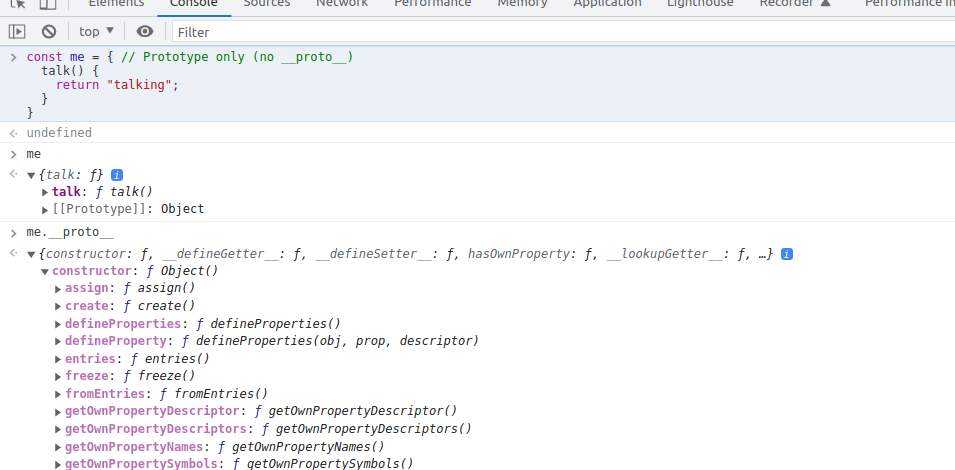
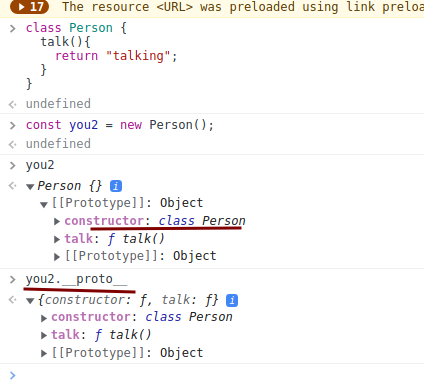
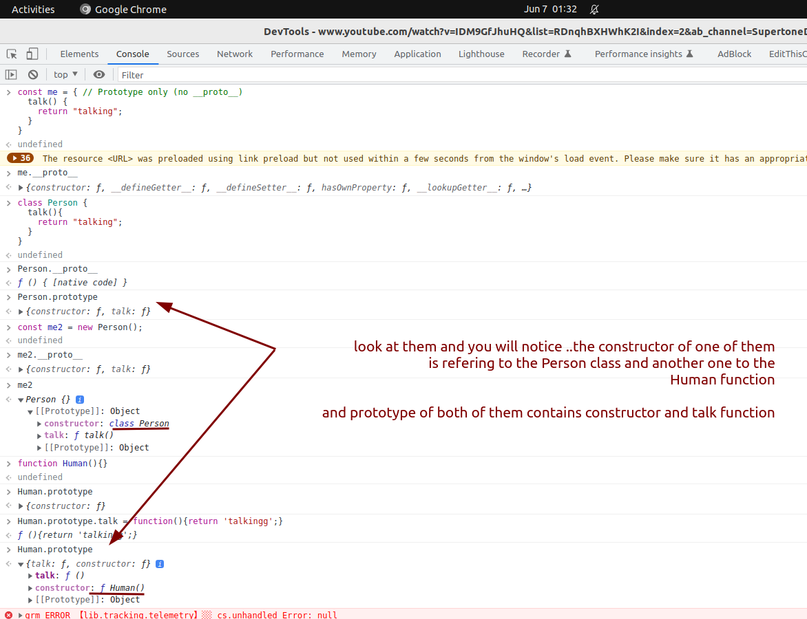
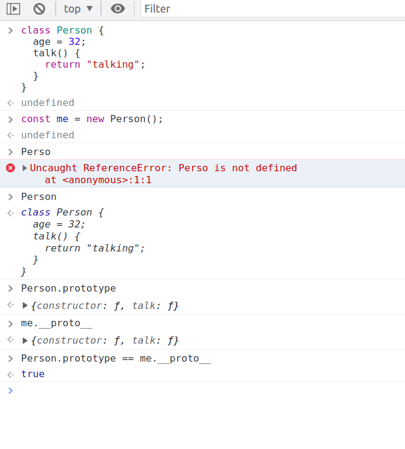
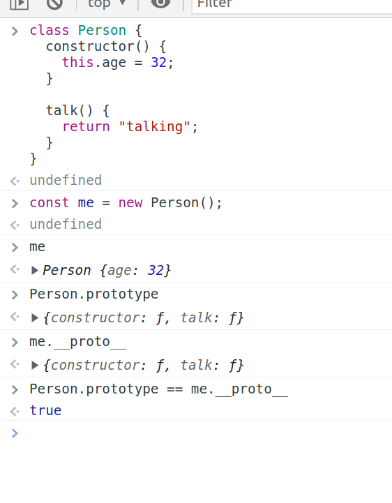
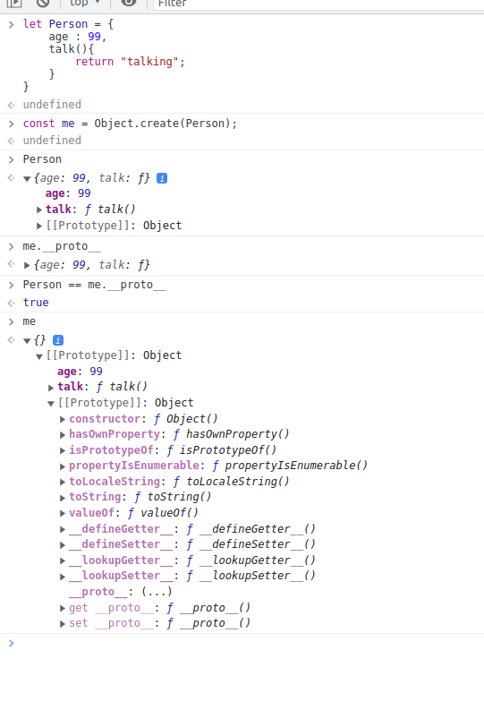
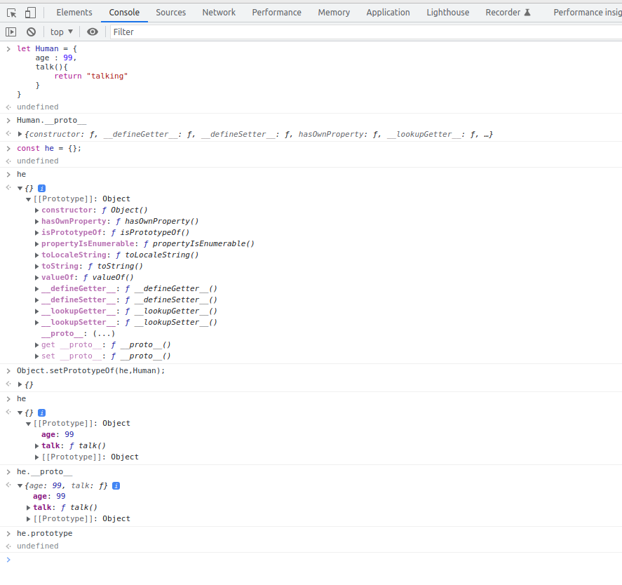

## EXAMPLE 1

```js
class Component {
  constructor() {}
  doBasicThing() {}
  doAnotherBasicThing() {}
}

class InteractiveComponent extends Component {
  constructor() {
    super();
  }

  doExtraCoolThing() {}
}
```

- Here we are attaching the method to the object and hence it is specific to this object and not to all objects. Notice that "talk" method can be found in the object itself and not int the "Prototypes" property of the 'me'/'you' objects.

```js
const me = {
  // Prototype only (no __proto__)
  talk() {
    return "talking";
  },
};

const you = {
  talk() {
    return "talking";
  },
};
```



## Difference between **proto** and prototype in javascript

<pre>
In JavaScript, both __proto__ and prototype are related to the prototype chain and object inheritance, but they serve different purposes.
1. <code>__proto__</code>:
   - <code>__proto__</code> is a non-standard property that allows you to access an object's prototype. It provides a way to access the prototype of an object directly. However, it's important to note that <code>__proto__</code> is deprecated and should not be used in modern JavaScript code.
   - Example: <code>object.__proto__</code>

2. <code>prototype</code>:
   - <code>prototype</code> is a property that exists on constructor functions. Constructor functions are used to create objects with similar properties and methods. When you define a constructor function, you can attach properties and methods to the function's <code>prototype</code> property. These properties and methods will be inherited by the instances created from the constructor function.
   - Example: <code>MyConstructor.prototype</code>

Regarding the <code>[[prototype]]</code> seen in consoles, it represents the internal property of an object that points to its prototype. The double square brackets <code>[[...]]</code> syntax indicates that it is an internal property not directly accessible in regular JavaScript code.

To access the prototype of an object in modern JavaScript, it is recommended to use <code>Object.getPrototypeOf()</code> or the <code>Object.create()</code> method for creating new objects with a specified prototype.

We can also use <code>Object.setPrototypeOf()</code> to set the prototype of an object.

Here's an example to illustrate the usage of <code>prototype</code> and <code>Object.getPrototypeOf()</code>:

<code>
// Constructor function
function Person(name) {
  this.name = name;
}

// Adding a method to the prototype
Person.prototype.greet = function() {
  console.log(`Hello, my name is ${this.name}`);
};

// Creating an instance
const john = new Person("John");

// Accessing the prototype using Object.getPrototypeOf()
const prototypeOfJohn = Object.getPrototypeOf(john);

// Checking if the prototype is Person.prototype
console.log(prototypeOfJohn === Person.prototype); // true
</code>

In the above example, <code>prototype</code> is used to define the <code>greet</code> method, which is then inherited by instances created from the <code>Person</code> constructor function. The <code>Object.getPrototypeOf()</code> method is used to access the prototype of the <code>john</code> object, which is <code>Person.prototype</code>.

</pre>

<pre>
- prototype property does not belong to any object or instance but rather to an constructor function or classes/function.
- We can use `__proto__` with an object to access its prototype properties(me.__proto__). But we can not use `me.prototype`(gives undefined).
- However we can use `prototype` with class(className.prototype) or function name(functionName.prototype) to access its prototype properties.
- className.__proto__ OR functionName.__proto__ returns `ƒ () { [native code] }` 
</pre>

**Usage of Inheritance**

- Inheritance is used to avoid code duplicacy and code rewriting.
- Also if we need to change/modify an method which is attached to all objects, in case of inheritance we need to modify only the class and not go to each object and then modify the method.

```js
class Person {
  talk() {
    return "talkking";
  }
}

const me = new Person();
Person.prototype == me.__proto__; //true
Person.prototype; // has constructor and talk function
me.talk(); //talkking

Person.prototype.talk = function () {
  return "improved talking";
};

me.talk(); //improved talking
```

## EXAMPLE 2

- Notice that "talk" method is not in the me/you object directly but instead in the [[Prototype]] prototype chain, hence it must be common to all object made using the Person class.
- Also notice how the "default [[Prototype]] Object" goes one step lower in the prototype chain.
  - you2.**proto**.**proto** == you.**proto** is true

```js
class Person {
  talk() {
    return "talking";
  }
}

const me2 = new Person();
const you2 = new Person();
Person.prototype == me2.__proto__; // true
```



- As seen in the image, the construcutor function got override by the constructor function we provided which is nothing but the class or the function used to create an object.



## EXAMPLE 3

- Inheritance in javascript is done through object or more specific prototype that is why we say Prototypal inheritance.
- "new" keyword when used.. does four things:

  - create an new empty object
  - assign that empty object to "this" key
  - updates the "this" object with properties and methods
  - returns "this" that is returns the object

- In javascript, 'classes' are just an syntactic sugar. Underneath it is creating an function and attaching methods to the function prototype property of the function.

```js
class Person{
  talk(){
    return 'talking';
  }
}

IS SAME AS

//known as constructor function
function Person(){}
Person.prototype.talk = function(){
  return 'talking';
}
```

## EXAMPLE 4

```js
class Person1{
  talk(){
    return 'talking';
  }
}

const me = new Person1();

class Person2{
  this.talk(){
    return 'talking';
  }
}

const you = new Person2();

- me and you are not same, object created with Person1 class have talk function attached to its prototype(so it is regarded as an method) whereas object created with Person2 class have talk function attached as an key to "this" object or me object and not in the protoype chain(so not regarded as an method instead an property of this object).In case of Person2 the talk function is specific to an object.
- Hence, in case of object created with Person2 class, we are not using the inheritance, that is each object will have talk as an key and hence change talk function in the Person2 wont change the function defination in the talk function of each object.
```

function Person(){
this.age = 12;
};

const they = new Person(); <br>
Person.age // undefined <br>
they.age // 12 <br>

- Here, age is an property of the "they" object which is an instance of the Person function.
- Hence we can not function age attaced to the Person prototype.

```
- In javascript..if one class extend another..whose contructor runs fitst
- In JavaScript, when one class extends another, the constructor of the subclass (derived class) is responsible for running first, followed by the constructor of the superclass (base class). This order ensures that the subclass has an opportunity to initialize its own properties and perform any specific setup before the superclass constructor is invoked.

class Animal {
  constructor(name) {
    console.log("Animal constructor");
    this.name = name;
  }
}

class Dog extends Animal {
  constructor(name, breed) {
    console.log("Dog constructor");
    super(name);
    this.breed = breed;
  }
}

const myDog = new Dog("Buddy", "Labrador");

```

## EXAMPLES 5 (other ways to create an Object)

```js
// FIRST WAY
class Person {
  age = 12; //attaching an property to the prototype chain
  talk() {
    return "hellow world";
  }
}
// This syntax is known as the "class field declaration" syntax. It allows you to directly initialize class instance variables, like age, without explicitly using the constructor method. This syntax is a more concise way of achieving the same result as the second code snippet.

const me = new Person();
Person.age; // undefined as age is an property
me.age; // 12
```



```js
// SECOND WAY
class Person {
  constructor() {
    this.age = 32; 
  }

  talk() {
    return "talking";
  }
}
const me = new Person();
Person.prototype;
me.__proto__;
Person.prototype = me.__proto__;
```



```note
- The difference in the FIRST and SECOND way to create Object lies in the syntax used to define the class, but the resulting behavior and the objects created from both approaches will be the same. 
- This syntax is known as the "class field declaration" syntax. It allows you to directly initialize class instance variables, like age, without explicitly using the constructor method. This syntax is a more concise way of achieving the same result as the second code snippet.

```

```js
//THIRD WAY
const Person = {
  age : 5,
  talk() {
    return "taling";
  },
};
const me = Object.create(Person); // when an object is passed to Object.create , the passed object is set in the prototype chain.
```


```js
//FOURTH WAY
const Person = {
  age : 5,
  talk() {
    return "taling";
  },
};
const you = {};
// first parameter is the instance and the second parameter is from where you want to inherit from.
Object.setPrototypeOf(me, Person); //set the prototype of Person to me
```


## EXAMPLES 6
- It is common to put all properties to the "this" object.
- And add methods to the prototype of its parent(function or class).
```js
function Person(age,name,gender){
  this.age = age;
  this.name = name;
  this.gender = gender;
}

Person.prototype.run = function(){
  //some code here
}

Person.prototype.talk = function(){
  //some code here
}

Person.prototype.walk = function(){
  //some code here
}
```


## Javascript Advanced TOPICS (for interviews)
- Hoisting
- Recursion
- new
- Functional programming
- Currying
- EVent loop
- Classes
- Cookies
- Generators
- Local storage
- Web dev tools