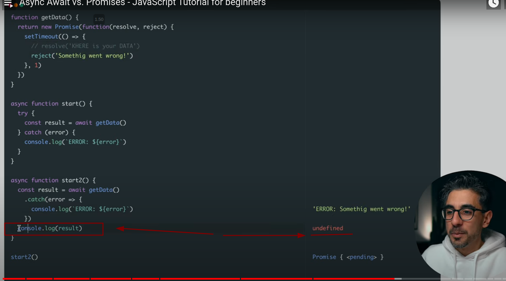

**Sceneraio where we can use async without await**
- Mostly the `async` and `await` are used together.
  - Exceptions: 
    - JS Modules
    - Chrome Dev Tools Console(dev tools allows you to use the await without async keyword)
- `async/await` only affects the `Promise` receiver.
- You can `await` any function that returns a `Promise`.
- Any function can be converted to `async` using `asnyc`
  ```js
  // we can even put async infront of method (functions inside objects)
  const me = {
    async sayHello(){
      const result = await callSomeAPI();
      return 'Hello World'
    },
    sayHii(){
      return 'Heyy'
    }
  }

  me.sayHello(); // Promise
  ```
- All async functions returns a Promise(by default).Even if it seems we are returning an string/number but in reality it returns an resolved.rejected Promise.
- Error handling with `try`/`catch` is better then using `then()` and `catch()` bcuz in try catch... the resolved and reject part are handled like if else statement... whereas using then() and catch() cause an problem bcuz they are handle like an process ... so we get undefined if we try to  console/use the resolved result.


**Cases where we an use await without async**

