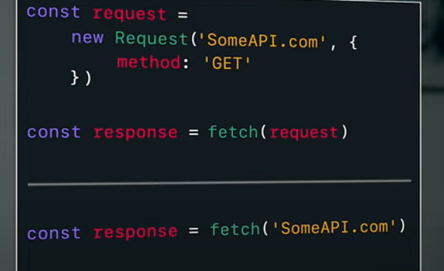
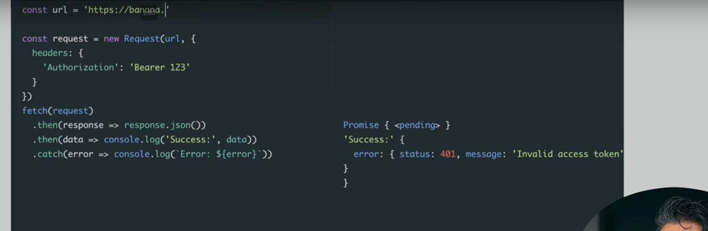
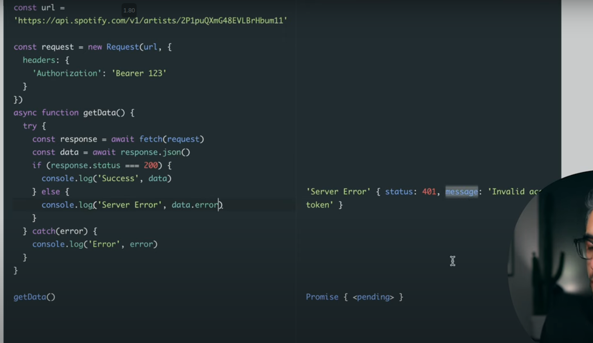

- `fetch()` is an web browser api to send request to an API.
- fetch() and xhr
- fetch sends an request object and also returns an response object(an promise that resolves to an response object)
  - `{ Response } = fetch({ Request })`

```js
const response = fetch("someRandomApi"); // what you seee
const request = new Request("someRandomApi"); // under the hood..making an request object
```

- The request object created have more than just api/request url... it has methods(get/post), headers, cache policy.. etc
- If we do not set the necessary things in the request object, then javascript by default set values.

- Both are same.


- fetch is an asynchronous operation, so fetch doesn't directly returns an response object.. instead it returns an Promise that resolves to an response object.

- In an API, even if we get an error it does not necessarily means that it is an error, it means the api round trip is successful even though what we got is an error object.
- Making an successfule trip to an API is considere success, regardless of what data that comes back(data is an error object and status is 401)
- But if the fetch operation itself fails, meaning that it can not connect/reach to the server. Thats when we will end up in the `catch()` block.
- Error from fetch() ends up in `catch()` block.
- Error from server is considered successful(even thought the result is an error object from the server with status 401 or something else) and we do not end up in `then()` block.



  